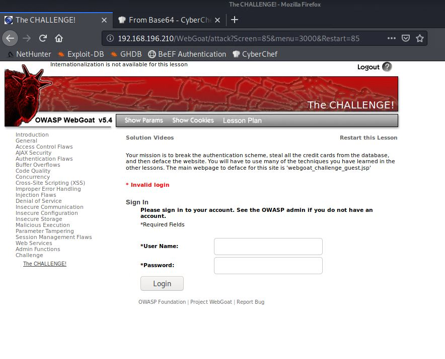

# WebGoat-XSS-Challenge
#### Using Cross-Site-Scripting (XSS) and Tamper Data on a vulnerable web server to gather login credentials and compromise the integrity of a website
#### By Glen Abalayan
## Technologies Used
* Foxy Proxy Web Scarab (FireFox Extension)
* Tamper Data for FF Quantum by Pamblam (FireFox Extension)
* CyberChef
## Environment Setup
1. Ensure both OWASP BWA and Kali machine are running.
2. Input the IP address of OWASP BWA machine into a browser on the Kali Linux machine.
3. Select OWASP WebGoat on the menu
	*Use the login credentials _guest_:_guest_ to continue to WebGoat
4. On the WebGoat website, navigate to the Challenge sub-menu on the left side of the page to begin the activity.

## Task 1: Breaking the authentication scheme
* To break the authentication scheme and 
## Task 2: Stealing all the credit cards from teh database
## Task 3: Defacing the website