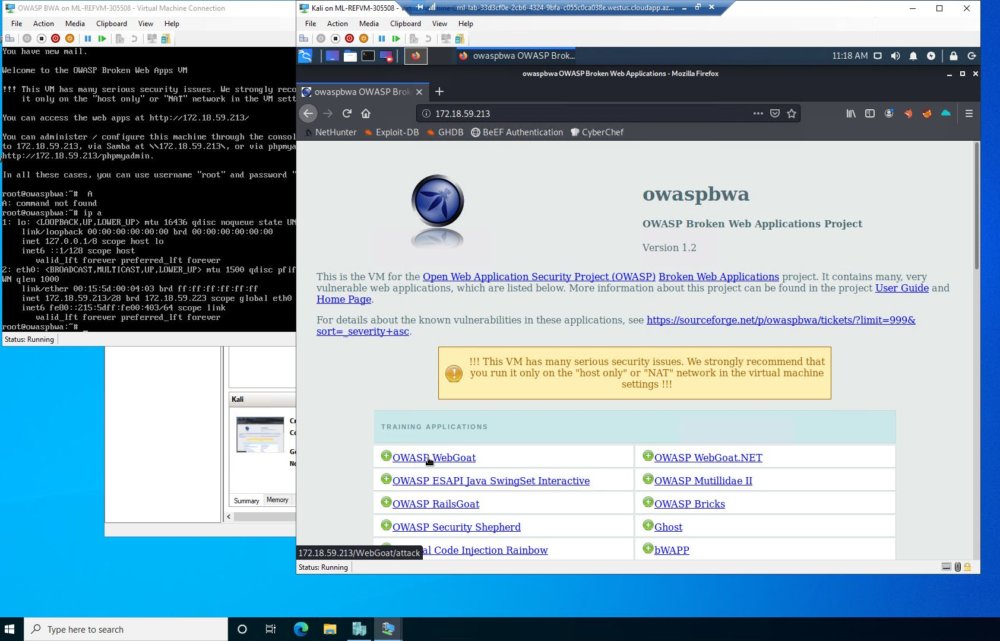
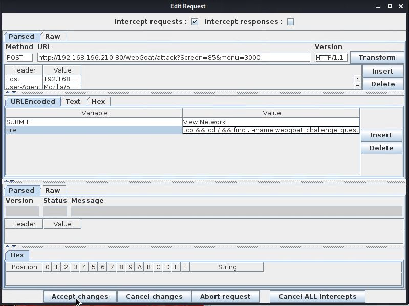

# WebGoat-XSS-Challenge
#### Using Cross-Site-Scripting (XSS) and Tamper Data on a vulnerable web server to gather login credentials and compromise the data integrity of its website
#### By Glen Abalayan
## Technologies Used
* Foxy Proxy Web Scarab (FireFox Extension)
* Tamper Data for FF Quantum by Pamblam (FireFox Extension)
* CyberChef
## Environment Setup
1. Ensure both OWASP BWA server and Kali Linux machine are running in the Hyper-V manager.
2. Input the IP address of OWASP BWA server into a browser on the Kali Linux machine.
3. Select OWASP WebGoat on the menu
	* 
	*Use the login credentials _guest_:_guest_ to continue to WebGoat
4. On the WebGoat website, navigate to the Challenge sub-menu on the left side of the page to begin the activity.

## Task 1: Breaking the authentication scheme
* To break the authentication scheme and gain access to the database, parse through the HTML source code to find clues about the login credentials.
	* To access the website's source code, replace the URL's parameters so that 	 __source?source=true__
	
* While on the source code, filter for passwords by running **Cntrl+F** and typing in "Password"
	*  Parsing for "Password" in the browser brings us the login credentails 
	__"youaretheweakestlink":"goodbye"__
	 
* Now that we have obtained login credentials from the source code, we will now use these credentials to log into the website
	* Log into the website with __"youaretheweakestlink":"goodbye"__
	* 
* Congratulations! You have completed Task 1. You have now cracked the website's authentication and can access the site.
## Task 2: Stealing all the credit cards from the database
* Now that you have logged into the website, it is time to steal credit card data from the database.
* Start the Tamper Data extension on your Firefox browser.
	* 
* With Tamper Data running, intercept and tamper an HTTP Post request by clicking on the "Buy Now" button and copy the user cookie. Copy everything inside the quotation marks. The cookie is written in Base64.
	* 
* Using CyberChef, input the copied Base64 user string and translate it from Base64 to ASCII.
	* Notice how the string translates to "youaretheweakestlink", the username we extracted in the previous step.
	* 
	* Our goal now is to insert malicious script alongside the string so the server responds back with credit card data from the database.
* Using Cyberchef, navigate to the "To Base64" translation tool and input this command to inject a script alongside the user cookie.
	* __youaretheweakestlink' OR '1'='1__
	* Copy the translated Base64 string from the Output.
	* 
* With Tamper Data open, replace the original username cookie string with the copied Base64 string that includes the injected script from the previous step.
	* 
* Sending the tampered data results to the server results in exposing credit card information from the database.
	* 
* Congratulations! You have completed Task 2. You used Cross-Site-Scripting (XSS) to extract private credit card information from a web server. 
## Task 3: Defacing the website
* Now that you have gained access to the site and retrieved private data from the database it is now time to deface the website!
* Start the FoxyProxy WebScarab extension from your Firefox Browser.
	* ! 
* You also need to have the WebScarab application running on your machine. To run the application, input __"webscarab"__ in your Linux terminal.
	* ! 
* Before we can run any commands, we must first test whether the site is vulnerable to XSS attacks and find where our attak would be located. 
	* With the WebScarab extension and application running, click on the "View Network" button, select tcp, and edit the request so that the Value for the File variable includes __"tcp && whoami && pwd"__
		* 
		* This command forces the server to not only run the original tcp command, but also __whoami__ and __pwd__
			* __whoami__ shows which user you are logged in as 
			* __pwd__ prints the current working directory you are located in.
	* Submitting the edited request results in the server telling us that we are logged in as __root__ and that we are currently located in __/var/lib/tomcat6__
		* 
* Now that we have established that the server is vulnerable to XSS attacks we must now locate the webpage in the server
	* Remember, the webpage we need to deface is __webgoat_challenge_guest.jsp__. We need to locate where this file is in order to change its contents.
	* To locate the file, you must first change directories to the root directory and run the find command to look for the webpage.
		* With WebScarab open, click on "View Network Status" again, select tcp, and edit the Value for the File variable to __"tcp && cd / && find . -iname webgoat_challenge_guest.jsp"__.
		* 
	* The injected script returns with the webpage's location at __./owaspbwa/owaspbwa-svn/var/lib/tomcat6/webapps/WebGoat/webgoat_challenge_guest.jsp__. 
		* 
* Now that we know which directory the webpage is located in, we can now naviage to the directory and deface the webpage. 
	* With WebScarab running, click on "View Network Status", select tcp, and edit the request so that the Value for the File variable is __"tcp && cd webapps/WebGoat && echo You have been hacked gg > webgoat_challenge_guest.jsp__
		* Remember, we did not have to write the absolute path because we are already in the __/var/lib/tomcat6/__ directory. 
	* 
	* Click "Accept Changes" in the WebScarab application and see whether the webpage has been altered.
* To confirm you have defaced the website, scroll to the bottom of the WebGoat Challenge webpage and compare the edited webpage with the original. 
	* 
* Congratulations you have completed Task 3 and have successfully completed WebGoat's XSS Challenge!
